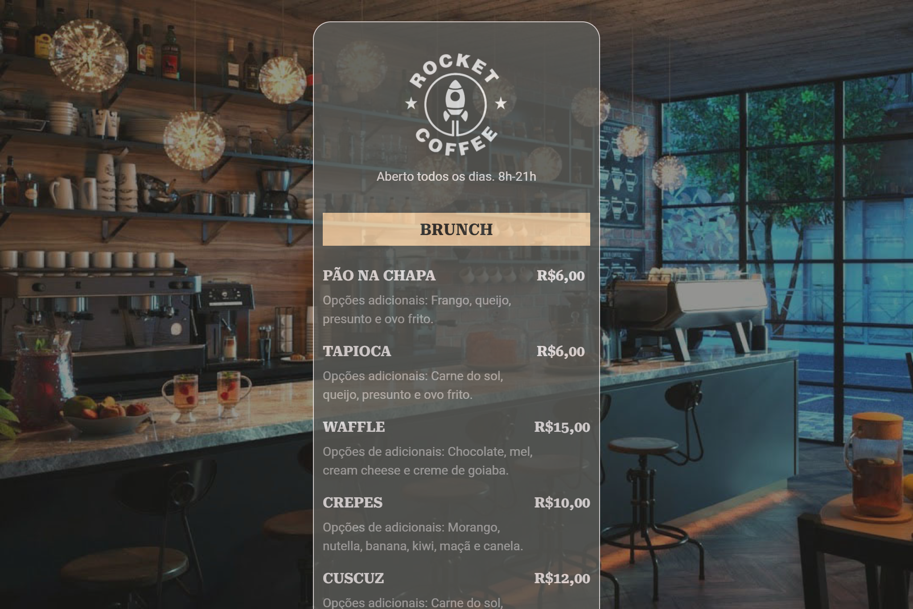

## RocketCoffee
> Maratona Explorer 3

Projeto construído no evento Maratona Explorer 3 da Rocketseat

> Trata-se de um cardápio online que pode ser acessado pelo seguinte QR Code:
\
\

[Clique aqui para acessar o projeto](https://campodonio.github.io/rocketcoffee/)

## 🛠 Tecnologias 

- HTML
- CSS
- Git e GitHub
